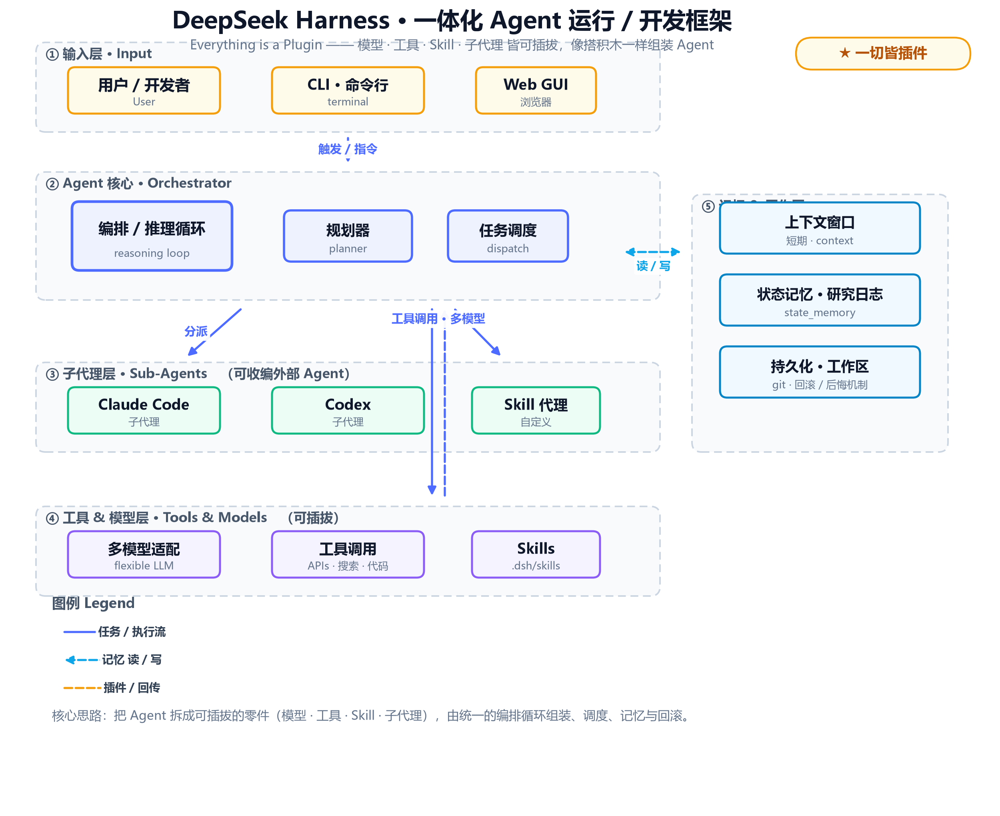

# 架构

> DSH 的分层结构与关键机制。一句话：**把 Agent 拆成可插拔的零件，由统一编排循环组装、调度、记忆与回滚。**

## 分层总览

| 层 | 作用 |
|---|---|
| ① 输入层 | 用户 / CLI / Web GUI |
| ② Agent 核心 | 编排 & 推理循环、规划、调度 |
| ③ 子代理层 | Claude Code / Codex / Skill 代理（可收编外部 Agent） |
| ④ 工具 & 模型层 | 多模型适配、工具调用、Skills |
| ⑤ 记忆 & 工作区 | 上下文、状态记忆、持久化 / 回滚 |

## 关键机制

- **插件总线**：模型、工具、Skill、子代理皆可插拔——"一切皆插件"。
- **Skill 按需加载**：每个能力一个 SKILL.md，按环节加载，而不是全量常驻。
- **子代理编排**：统一调度的核心，能收编外部 Agent。
- **记忆与回滚**：上下文（短期）、状态记忆、工作区持久化，以及"后悔药"式的回滚。

## 为什么这样设计

- **可组合**：零件化，按需拼装，不强耦合。
- **可插拔**：想换模型 / 工具 / 子代理，热插拔即可。
- **可复现**：环境、状态、过程可沉淀，便于回溯与审计。

!!! note "延伸"
    - 想查具体概念 → [术语表](glossary.md)
